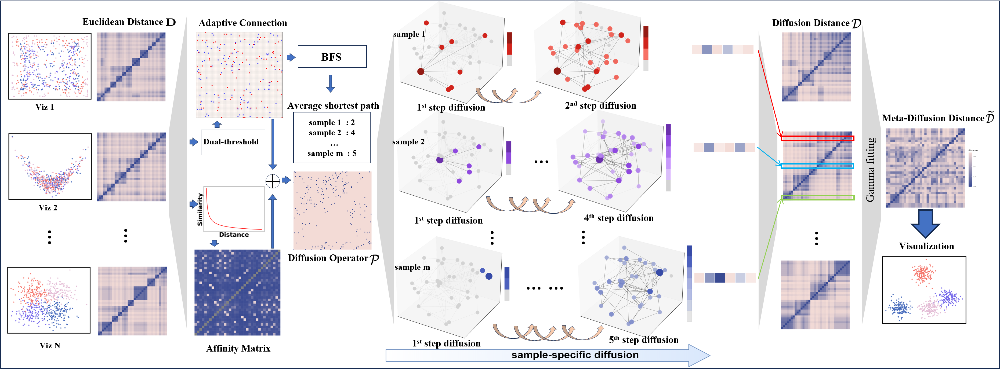

# ADMPackage: Adaptive Graph Diffusion for Meta-Dimension Reduction

## Overview

For each output from an individual candidate dimension reduction technique, the **ADM** approach initiates by transforming the Euclidean distance of features into a diffusion operator P. This operator quantifies the likelihood of information propagation between samples through random walks. 
Subsequently, a sample-specific diffusion process is implemented for each sample to simulate multi-step diffusion. We employ the Breadth-First Search (BFS) algorithm to adaptively select the appropriate diffusion time scale for each sample. This adaptive strategy considers the inherent heterogeneity within datasets, effectively filters out noise, and prevents over-smoothing. The resulting sample-specific propagation probabilities are then utilized to calculate the diffusion distances. 
These diffusion distances leverage the dynamic Markov process to link the Euclidean distance with geometric densities, highlighting the intrinsic similarities and differences among samples in the information manifold, serving as a robust metric for quantifying the relative positions within the information space .

Next, we combine the diffusion distance matrices from all candidate methods using harmonic averaging and gamma distribution-based normalization to construct a comprehensive meta-diffusion-distance matrix. This distance leverages the advantages of individual candidate techniques, providing a robust representation of the dataset and enabling in-depth exploration of complex relationships among samples.



## Installation

You can install the development version of ADMPackage from GitHub with:

```r
# install.packages("devtools")
devtools::install_github("Seven595/ADM")
```

## Features

- Meta-dimension Reduction Approach

  - Integrates results from multiple individual dimension reduction techniques
  - Leverages strengths of various methods while suppressing individual distortions

- Information Diffusion Theory Foundation

  - Employs a dynamic Markov process to simulate information propagation between data points
  - Transforms Euclidean space results into an information space

- Adaptive Diffusion Mechanism

  - Dynamically selects optimal diffusion time scale for each sample
  - Captures both local and global structures within the data
  - Effectively represents intricate multi-scale structures

- Nonlinear Manifold Structure Revelation

  - Uncovers intrinsic nonlinear manifold structures that conventional distance-preserving techniques may miss

- Noise and Distortion Mitigation

  - Reduces technique-specific distortions and noise by integrating multiple method outputs

- Balance Between Global and Local Structures

  - Achieves a balance in preserving both global coherence and local details of data

    

## Tutorials

Here's a basic example of how to use ADMPackage:

```r
library(ADMPackage)

# Assuming you have your data and cluster information
# Using Oihane dataset as an example
load("data/Oihane/Oihane.Rdata")
dat = Oihane
cell.type = as.factor(Oihane.info.cellType)
info = as.factor(Oihane.info.cellType)

# Calculate the output results of individual dimension reduction methods
candidate.out <- ADM::candidate.visual(data, dim = 3)
candidate_result = candidate.out[[1]]
names_list = candidate.out[[2]]

# Calculate ADM dimension reduction results
adm.out = adm(candidate_result)

# Quantify ADM dimension reduction results
results = process_and_visualize_meta_methods(adm.out, info, color_list)

ARI_NMI = results$ARI_list
ASW = results$ASW_list

# Visualize individual dimension reduction technique results
p = visualize_individual_methods(e, names_list, info, color_list)

# Visualize ADM results
results[[3]]
```

## Main Functions

`adm()`: Performs Adaptive Graph Diffusion for Meta-Dimension Reduction
- Combines multiple dimension reduction results into a single merged distance matrix
- Uses graph diffusion and various normalization techniques
- Key parameters: `e` (list of matrices), `k.dim`, `dist.power`, `conn.prop`, `diffu.steps`

`zp.quantile()`: Quantile Normalization Function
- Normalizes a vector based on the quantiles of a reference vector
- Parameters: `x` (reference vector), `y` (vector to be normalized)

`move.outlier()`: Move Outliers Function
- Detects and adjusts outliers in a vector or matrix
- Parameters: `x` (input data), `d` (distance threshold), `fraction` (outlier fraction)

`candidate.visual()`: Calculate Individual Dimension Reduction Methods
- Applies various dimension reduction techniques to the input data
- Returns a list of reduction results and method names

`process_and_visualize_meta_methods()`: Process and Visualize Meta-Methods
- Quantifies and visualizes the results of meta-dimension reduction methods
- Parameters: `adm.out` (ADM results), `info` (cluster information), `color_list`

`visualize_individual_methods()`: Visualize Individual Dimension Reduction Methods
- Creates visualizations for each individual dimension reduction technique
- Parameters: `e` (reduction results), `names_list` (method names), `info` (cluster information), `color_list`

`umap5()`: Perform UMAP and calculate distance-based group statistics

- Applies UMAP to input data and computes distance-based group statistics
- Parameters: `x` (distance matrix), `info` (group labels), `do.plot`, `n_components`, `k` (neighbors)
- Returns mean distance-based group statistics across multiple UMAP runs

`dist.grp()`: Calculate distance-based group statistics
- Computes distance-based group statistics for a given distance matrix and grouping
- Parameters: `distmat` (distance matrix), `grp` (group labels), `k` (neighbors)
- Returns a matrix with k values and corresponding statistics

`cal_cci()`: Calculate Cluster Conservation Index (CCI)
- Calculates CCI for ensemble and ADM methods
- Parameters: `ensemble.out` (ensemble method output), `mev.out` (ADM method output), `info` (cluster information)
- Returns CCI values for different representations (raw, UMAP, PCA)

`cal_ari_nmi()`: Calculate Adjusted Rand Index (ARI) and Normalized Mutual Information (NMI)
- Performs k-means clustering and calculates ARI and NMI scores
- Parameters: `lowDim_data`, `k` (number of clusters), `method_name`, `seed`, `info` (true class labels)
- Returns a data frame with ARI and NMI scores

